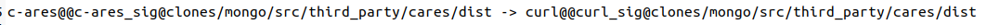
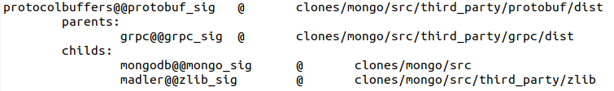

# CNEPS
`CNEPS` is a tool that can examine dependencies among reused components for a given input C/C++ source code project.
The approaches we used in this tool and the evaluation results are discussed in our paper which will be published in 46th International Conference on Software Engineering (ICSE 2024).

`CNEPS` provides a handy method to set up both `CNEPS` and the required environment using a docker file including source code.

Anyone interested in `CNEPS` can reproduce the results provided in the paper and other C/C++ source code projects.
We hope that `CNEPS` can inspire people who are interested in reused components analysis as well as the Software Bill of Material (SBOM) Generation area.


## Setup

### Setup using docker

We provide our executable using Docker images for simple setup including running environments.
Run the following command after installing Docker:

`docker pull sodium49/cneps:init`

After installing the Docker images, you can locate our executable in the "home/cneps" directory. Run the following command to run the CNEPS docker container, the command will automatically run the bash shell in the CNEPS container:

`docker run -it --name cneps sodium49/cneps:init /bin/bash`

After installing the Docker images, you can locate our executable in the "home/cneps" directory. Run the follwing command to loacate our executables:


```
cd /home/cneps/
ls
```

### Setup by building

1. Install `universal` ctags:

```
apt-get install universal-ctags
```


2. After cloning or unzipping the source code of `CNEPS`, download the following requirements using pip:

```
python3 -m pip install python-tlsh
python3 -m pip install networkx
python3 -m pip install matplotlib
python3 -m pip install plotly
```


## Component Database

`CNEPS` detects components using the Centris module.

1. Using the provided dataset

* Centris is providing its component DB used for evaluation (DOI: 10.5281/zenodo.4514689).
You can download it from Zenodo and locate it with the CNEPS.

2.  Generating new component DB

* You can follow the instructions provided in Centris GitHub (see https://github.com/WOOSEUNGHOON/Centris-public).
`CNEPS` only requires the `componentDB`, `metaInfos` and `aveFuncs` directories generated after running the `Preprocessor`.

Copy or move the `componentDB` with the same directory of `CNEPS` and move `aveFuncs` to the `metaInfos/aveFuncs` directory.

## Usage

After you input any source code project you wants to examine, 
Run the following command to run the `CNEPS`.
Note that the current `CNEPS` targets C/C++ source code.

```
python3 cneps.py {Input Project Path}
```

## The output explannation

The output will be saved in `cneps-res` directory.

* `{Input Project Name}_edges` contains edges discovered by `CNEPS` and 
    * `Component Node -> Component Node` means 
    * For example, the following line means the component `c-ares` has a dependency on `curl` component
    * `c-ares@@c-ares_sig@... -> curl@@curl_sig@...`

* `{Input Project Name}_nodes` contains information on component discovered by `CNEPS`.
    *  For example, from the following example, a `c-ares` component is cloned at `clones/mongo/src/third_party/cares/dist`
    * Likewise, this component has a dependency on `curl` component cloned at `clones/mongo/src/third_party/cares/dist` directory
```
c-ares@@c-ares_sig      @       clones/mongo/src/third_party/cares/dist
        childs: 
                curl@@curl_sig  @       clones/mongo/src/third_party/cares/dist
```


* `{Input Project Name}_time` contains the time taken to analyze dependencies for each module in seconds
    * `centrisTime` means the time taken for `Centris` to analyze components
    * `moduleTime` means the time taken for `CNEPS` to construct modules
    * `depsAnalysisTime` means the time taken for `CNEPS` to analyze dependencies and generate a graph


## Note
1. Because `CNEPS` saves Centris results, parsed headers, and definitions at `cneps-meta` directory, please delete `cneps-meta` directory to accurately evaluate the performance
2. Because `CNEPS` utilizes `Centris` to identify reused functions, it takes longer time than the result we have shown in the evaluation section, which only presents time taken by `CNEPS`

## How to reproduce results

In our Docker container, we also included the source code of the representative dataset with the same version: `MongoDB` in the `clones` directory.
This is also available from our source code from Zenodo in the `testset` directory.

1. Run CNEPS using the following command:
    * `python3 cneps.py "clones/mongo"`


2. The result will be saved in `cneps-res` directory
    * `{Input Project Name}_edges` contains edges discovered by `CNEPS`
    * The Below figure is an example case from `MongoDB` where `c-ares` cloned at `third_party/cares/dist` has a dependency on `curl` cloned at the same directory as a code reuse
    
    * `{Input Project Name}_nodes` contains information on nodes discovered by `CNEPS`
    * The Below figure is an example case from `MongoDB` where `grpc` has a dependency on `protobuf` as a library dependency
    

